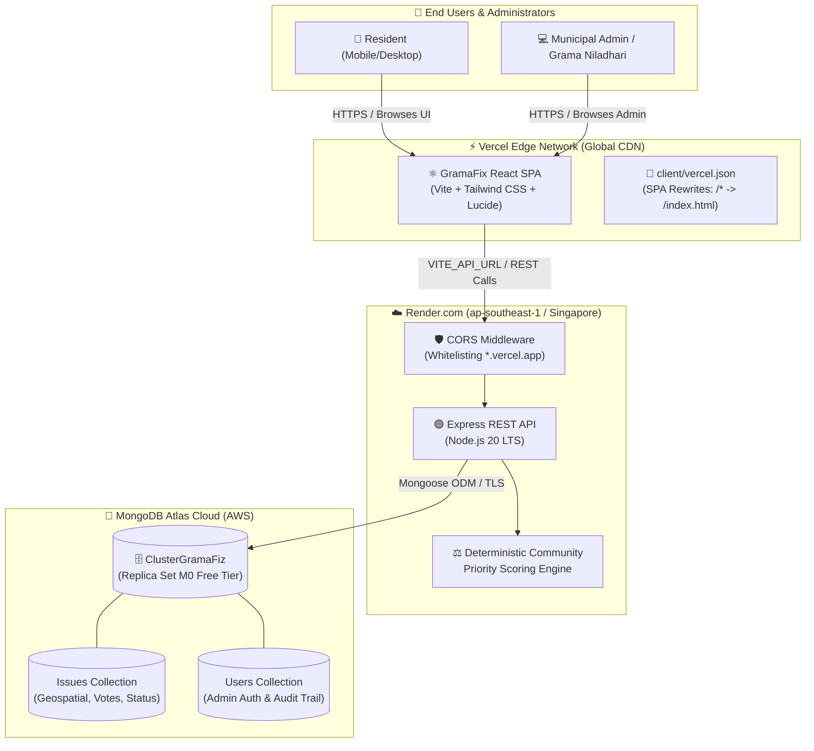

# GramaFix — Production Deployment Guide 🚀

> **Target Audience**: GramaFix Engineering Team (Members 1, 2, and 3)  
> **Target Stack**: Vite + React 18 (Client), Node.js + Express (Server), MongoDB Atlas (Database)  
> **Recommended Hosting**: **Vercel** (Frontend) + **Render** (Backend) + **MongoDB Atlas** (Database)

---

## 📋 Table of Contents
1. [Architecture Overview](#-architecture-overview)
2. [Deployment Prerequisites](#-deployment-prerequisites)
3. [Environment Variables Reference](#-environment-variables-reference)
4. [Step 1: MongoDB Atlas Configuration](#step-1-mongodb-atlas-configuration)
5. [Step 2: Backend API Deployment (Render.com)](#step-2-backend-api-deployment-rendercom)
6. [Step 2 (Alternative): Backend API on Railway](#step-2-alternative-backend-api-on-railway)
7. [Step 3: Frontend Deployment (Vercel)](#step-3-frontend-deployment-vercel)
8. [Step 3 (Alternative): Frontend Deployment (Netlify)](#step-3-alternative-frontend-deployment-netlify)
9. [Step 4: Post-Deployment Smoke Test Checklist](#-step-4-post-deployment-smoke-test-checklist)
10. [Step 5: Hackathon Troubleshooting & Operational Tips](#-step-5-hackathon-troubleshooting--operational-tips)

---

## 🏛️ Architecture Overview

The GramaFix platform utilizes a decoupled, modern two-tier cloud architecture designed for high availability, instant global asset caching, and deterministic ranking compute:



---

## 🧰 Deployment Prerequisites

Before deploying, ensure you have the following access and accounts ready:

| Resource | Service | Purpose | Recommended Plan |
| :--- | :--- | :--- | :--- |
| **Git Repository** | [GitHub](https://github.com/Raashidh-Rizvi/MiniHack) | Source code hosting & automated CI/CD triggers | Free |
| **Database** | [MongoDB Atlas](https://cloud.mongodb.com/) | Managed MongoDB replica set with seeded data | Shared M0 (Free) |
| **Backend Host** | [Render](https://render.com/) or [Railway](https://railway.app/) | Node.js / Express Web Service runtime | Free Tier / Hobby |
| **Frontend Host** | [Vercel](https://vercel.com/) or [Netlify](https://netlify.com/) | Vite + React static hosting with edge CDN | Hobby (Free) |
| **Uptime Monitor** | [cron-job.org](https://cron-job.org) or [UptimeRobot](https://uptimerobot.com) | Keep free backend active (prevent cold starts) | Free |

---

## 🔐 Environment Variables Reference

### 1. Backend Server (`server/.env`)
Set these environment variables in your backend hosting provider (e.g. Render/Railway dashboard):

| Variable | Required | Default / Format | Description |
| :--- | :---: | :--- | :--- |
| `NODE_ENV` | **Yes** | `production` | Enables Express production optimizations and error handling |
| `PORT` | **No** | Auto-injected (defaults to `5000`) | Port assigned dynamically by Render/Railway |
| `MONGO_URI` | **Yes** | `mongodb+srv://<user>:<password>@clustergramafiz...` | Primary MongoDB Atlas connection string |
| `MONGODB_URI` | **No** | Same as `MONGO_URI` | Fallback alias supported by connection script |
| `JWT_SECRET` | **Yes** | `[random-64-character-hex-or-phrase]` | Secret key used for signing administrative JWT tokens |

> [!WARNING]
> Never commit active credentials into Git. Make sure `server/.env` is listed in your root `.gitignore`.

### 2. Frontend Client (`client/.env.production`)
Set these environment variables in your frontend hosting provider (e.g. Vercel dashboard):

| Variable | Required | Default / Format | Description |
| :--- | :---: | :--- | :--- |
| `VITE_API_URL` | **Yes** | `https://gramafix-api.onrender.com/api` | Base URL pointing to the deployed backend REST API |

> [!IMPORTANT]
> In Vite applications, all environment variables exposed to the client **MUST** be prefixed with `VITE_`.

---

## Step 1: MongoDB Atlas Configuration

1. **Log in to MongoDB Atlas**:
   Navigate to [cloud.mongodb.com](https://cloud.mongodb.com/).
2. **Whitelist Inbound Network IP Addresses**:
   - In the left sidebar, click **Security** → **Network Access**.
   - Click **Add IP Address**.
   - Select **Allow Access from Anywhere** (`0.0.0.0/0`).
   - Click **Confirm**.
   > [!NOTE]
   > Dynamic cloud platforms like Render, Railway, and Vercel use rotating outbound IPs. Setting `0.0.0.0/0` is necessary for serverless and free-tier containers to connect reliably.
3. **Verify Database User Credentials**:
   - In the left sidebar, click **Security** → **Database Access**.
   - Ensure the user (e.g., `atheekfareez47_db_user`) has `Read and write to any database` permissions.
   - If the password contains special characters (e.g. `@`, `:`, `/`, `#`), ensure they are URL-encoded.
4. **Copy the Connection String**:
   - Click **Database** → **Connect** → **Drivers** (Node.js).
   - The connection format must resemble:
     ```text
     mongodb+srv://<username>:<password>@clustergramafiz.mt9mcof.mongodb.net/gramafix?retryWrites=true&w=majority&appName=ClusterGramaFiz
     ```

---

## Step 2: Backend API Deployment (Render.com)

Render is the recommended host for the GramaFix Express backend due to its native Node.js support and zero-config deployment.

### 1. Create a New Web Service
1. Sign in to [dashboard.render.com](https://dashboard.render.com/).
2. Click **New +** → **Web Service**.
3. Select **Build and deploy from a Git repository** and connect `Raashidh-Rizvi/MiniHack`.

### 2. Configure Service Settings
Fill in the configuration fields exactly as specified:

| Setting | Value | Notes |
| :--- | :--- | :--- |
| **Name** | `gramafix-api` | Will create URL: `https://gramafix-api.onrender.com` |
| **Region** | `Singapore (Southeast Asia)` | Lowest latency to Sri Lankan internet traffic |
| **Branch** | `main` | Production branch |
| **Root Directory** | `server` | **Critical**: Points Render to the Express subdirectory |
| **Runtime** | `Node` | LTS environment |
| **Build Command** | `npm install` | Installs Express, Mongoose, CORS, Morgan |
| **Start Command** | `npm start` | Executes `node server.js` |
| **Instance Type** | `Free` | 512 MB RAM, 0.1 CPU |

### 3. Configure Environment Variables
Under the **Environment Variables** section on Render, add the following key-value pairs:

```env
NODE_ENV = production
MONGO_URI = mongodb+srv://<username>:<password>@clustergramafiz.mt9mcof.mongodb.net/gramafix?retryWrites=true&w=majority&appName=ClusterGramaFiz
JWT_SECRET = your_jwt_secret_key_here
```

### 4. Configure Health Check Endpoint
1. Scroll down to **Advanced**.
2. Set **Health Check Path** to `/api/health`.
3. Click **Create Web Service**.

### 5. Validate Backend Deployment
Once the deployment build finishes, test the live API endpoints using your browser or terminal:

```bash
# 1. Health check ping
curl -i https://gramafix-api.onrender.com/api/health

# Expected response:
# HTTP/2 200 OK
# {"status":"online","product":"GramaFix REST API","version":"1.0.0", ...}

# 2. Fetch seeded community issues
curl -i https://gramafix-api.onrender.com/api/issues
```

> [!TIP]
> Copy the deployed backend URL (e.g. `https://gramafix-api.onrender.com`). You will need it in Step 3!

---

## Step 2 (Alternative): Backend API on Railway

If Render build queues are congested during the hackathon, Railway provides an instant alternative:

1. Sign in to [railway.app](https://railway.app/).
2. Click **New Project** → **Deploy from GitHub repo** → select `MiniHack`.
3. In the service settings:
   - **Root Directory**: `server`
   - **Build Command**: `npm install`
   - **Start Command**: `node server.js`
4. In the **Variables** tab, add:
   - `PORT=5000`
   - `NODE_ENV=production`
   - `MONGO_URI=mongodb+srv://...`
   - `JWT_SECRET=...`
5. In the **Settings** tab under **Networking**, click **Generate Domain** (e.g., `gramafix-server.up.railway.app`).

---

## Step 3: Frontend Deployment (Vercel)

Vercel provides edge delivery, global caching, automated preview deployments, and zero-downtime rollouts for Vite + React.

### 1. Import Repository
1. Log in to [vercel.com](https://vercel.com/).
2. Click **Add New...** → **Project**.
3. Import the `MiniHack` repository.

### 2. Configure Project Settings
In the **Configure Project** window:

| Setting | Value | Notes |
| :--- | :--- | :--- |
| **Project Name** | `gramafix` | Accessible at `https://gramafix.vercel.app` |
| **Framework Preset** | `Vite` | Auto-detected |
| **Root Directory** | `client` | Click **Edit** and choose `client` |
| **Build Command** | `npm run build` | Runs `tsc && vite build` |
| **Output Directory** | `dist` | Default Vite build directory |
| **Install Command** | `npm install` | Installs client dependencies |

### 3. Add Environment Variables
Expand the **Environment Variables** section and add:

```env
VITE_API_URL = https://gramafix-api.onrender.com/api
```
*(Replace `https://gramafix-api.onrender.com` with your actual backend URL from Step 2)*

### 4. Single-Page Application (SPA) Routing Configuration
Deep routes such as `/admin`, `/my-reports`, and `/issues/new` require SPA rewrites so that page reloads route to `index.html`. This repository includes [`client/vercel.json`](file:///d:/Project/MiniHack/client/vercel.json):

```json
{
  "rewrites": [
    {
      "source": "/(.*)",
      "destination": "/index.html"
    }
  ]
}
```

### 5. Deploy & Verify
1. Click **Deploy**.
2. Wait ~60 seconds for the build to complete.
3. Click the assigned deployment link (e.g., `https://gramafix.vercel.app`).

---

## Step 3 (Alternative): Frontend Deployment (Netlify)

If deploying via Netlify:

1. Log in to [app.netlify.com](https://app.netlify.com/) → **Add new site** → **Import an existing project**.
2. Select GitHub and choose `MiniHack`.
3. Set configuration:
   - **Base directory**: `client`
   - **Build command**: `npm run build`
   - **Publish directory**: `client/dist`
4. Under **Environment variables**, set:
   - `VITE_API_URL = https://gramafix-api.onrender.com/api`
5. Create a `client/public/_redirects` file with the following content to handle SPA routing:
   ```text
   /*    /index.html   200
   ```
6. Click **Deploy Site**.

---

## 🧪 Step 4: Post-Deployment Smoke Test Checklist

Execute this verification sequence to guarantee system integrity before presenting or submitting:

| Test ID | Area | Verification Steps | Expected Result | Pass/Fail |
| :---: | :--- | :--- | :--- | :---: |
| **SMK-01** | **Backend Health** | Send `GET /api/health` via browser or cURL | HTTP 200 with status `"online"` and timestamp | [ ] |
| **SMK-02** | **CORS Handshake** | Open browser console on frontend and check network tab | No `Access-Control-Allow-Origin` errors | [ ] |
| **SMK-03** | **Feed Loading** | Navigate to `/` and inspect community feed | Seeded Sri Lankan issues render with priority badges | [ ] |
| **SMK-04** | **Issue Submission** | Fill citizen report form at `/report` with photo and location | Returns success toast, persists in DB, recalculates queue | [ ] |
| **SMK-05** | **Community Upvote** | Click "Upvote / Support" on any reported issue | Counter increments immediately without page refresh | [ ] |
| **SMK-06** | **Priority Scoring** | Verify priority queue order on `/admin` | Formula matches: $(0.4S + 0.3I + 0.2U + 0.1A)$ | [ ] |
| **SMK-07** | **Status Transition**| Update status (`REPORTED` $\to$ `IN_PROGRESS` $\to$ `RESOLVED`) | Status tag changes and audit note is logged | [ ] |
| **SMK-08** | **Deep Route Reload**| Navigate to `/my-reports` and press browser refresh (F5) | Page loads cleanly without 404 Not Found error | [ ] |
| **SMK-09** | **Mobile Responsiveness**| Toggle mobile viewport (375px) in Chrome DevTools | Bottom navigation bar active, cards stack cleanly | [ ] |

---

## 🛠️ Step 5: Hackathon Troubleshooting & Operational Tips

### 1. Render Free Tier "Cold Start" Delays
- **Symptom**: The first API request after 15 minutes of inactivity takes 45–60 seconds to respond.
- **Cause**: Render spins down free Web Services after 15 minutes of idle time.
- **Solution**: Set up a free automated heartbeat pinger:
  1. Go to [cron-job.org](https://cron-job.org) or [uptimerobot.com](https://uptimerobot.com).
  2. Create a monitor targeting `https://gramafix-api.onrender.com/api/health`.
  3. Schedule the ping every **10 minutes**.
  4. This prevents the container from idling during live demonstrations!

### 2. CORS (Cross-Origin Resource Sharing) Issues
- **Symptom**: `Access to XMLHttpRequest at '...' from origin 'https://gramafix.vercel.app' has been blocked by CORS policy`.
- **Cause**: Frontend origin not permitted by the backend CORS configuration.
- **Solution**: GramaFix's `server/server.js` dynamically permits all `.vercel.app` subdomains. If using a custom domain (e.g. `gramafix.lk`), add it to `allowedOrigins` in [`server/server.js`](file:///d:/Project/MiniHack/server/server.js):
  ```javascript
  const allowedOrigins = [
    'http://localhost:5173',
    'http://127.0.0.1:5173',
    'https://gramafix.vercel.app',
    'https://your-custom-domain.com'
  ];
  ```

### 3. MongoDB `MongooseServerSelectionError`
- **Symptom**: Backend logs display `Could not connect to MongoDB... buffering timed out`.
- **Cause**: IP restriction blocking connection from Render or wrong password.
- **Checklist**:
  1. Confirm **Network Access** in MongoDB Atlas contains `0.0.0.0/0`.
  2. Ensure the database user password does not contain unescaped characters (`@`, `?`, `/`).
  3. Ensure the database name `gramafix` is included in the connection string path.

### 4. Vercel 404 on Refresh (React Router SPA)
- **Symptom**: Navigating to `https://gramafix.vercel.app/admin` works, but refreshing the page returns `404 Not Found`.
- **Cause**: Vercel tries to find a static file at `/admin/index.html`.
- **Solution**: Ensure [`client/vercel.json`](file:///d:/Project/MiniHack/client/vercel.json) is committed with the `rewrites` rule targeting `/index.html`.

### 5. Missing Client Environment Variables in Production Build
- **Symptom**: Client sends API calls to `http://localhost:5000/api` even in production.
- **Cause**: `VITE_API_URL` was not defined before `npm run build` ran on Vercel.
- **Solution**: Ensure `VITE_API_URL` is configured in Vercel **Settings** → **Environment Variables**, then trigger a **Redeploy** (Deployments → Three dots → Redeploy).

---

## 📞 Deployment Team Contacts

- **Lead DevOps & Backend Coordinator**: Member 1 (*Server & DB Architect*)
- **Frontend & Integration Coordinator**: Member 2 (*Citizen Flow & Client Lead*)
- **Admin Portal & QA Coordinator**: Member 3 (*Analytics & Audit Trail Lead*)

*For detailed specifications, scoring algorithms, and rubric requirements, refer to [SPECIFICATION.md](file:///d:/Project/MiniHack/SPECIFICATION.md).*
